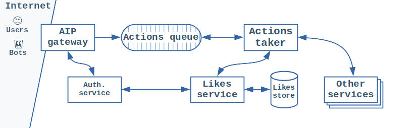

# You're not gonna like this

## Background

You are working on a social networking platform _Likker_, specifically its backend API system. Handling likes is especially important for you. Not only does it give the app its name, but it also generates revenue. _Likker_ is funded by advertisers who pay extra if their organically written adds start trending among your users. Likes directly contribute to that, so it's important for the system to handle them in timely manner.

_Likker_ API design follows the query command segregation pattern. It's architecture is based around a queue. API gateway component validates API requests and authenticates a user making them. If everything is OK it enqueues the request and returns an answer back to the user. Action taker component then reads the like requests and sends them on to likes service for processing. Likes service does some authorization work and then stores the like and all related information into a persisted storage.

These are some new features you've rolled out recently:

* _Likker_ API has been opened up to bots. Users can now build automated bots that can interact with the API. Interactions include posting new content and liking existing posts. Each bot is tied to a particular user and inherits that user's access rights.
* _Likker_ has recently implemented a system-vide ban feature. It allows one user to ban another one. This prevents the banned user from interacting in any way with the first user. In case of Likes service this means that user sending a like needs to be authorized to like a post.
* API team introduced a queue that they use to store valid API requests into. If Likes service processing fails request is requeued and processing is retried. If there's a spike in API load its smoothed over by the constant read speed of Actions taker. And if latency of like processing jumps up API clients don't feel.

## Likes infrastructure

## Inciting incident

It's Friday afternoon, you've just finished your work day and are hanging out with your teammates in a local pub. Your drinks are fresh, the atmosphere is jolly, and an alert from Alertmanager you all receive is unexpected! It informs you that actions queue will run out of disc space in 1 hour!

